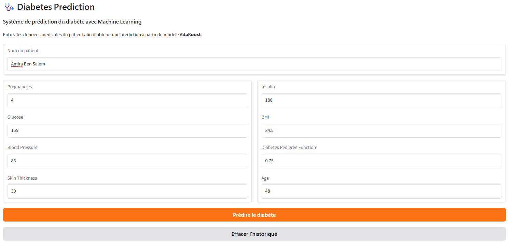
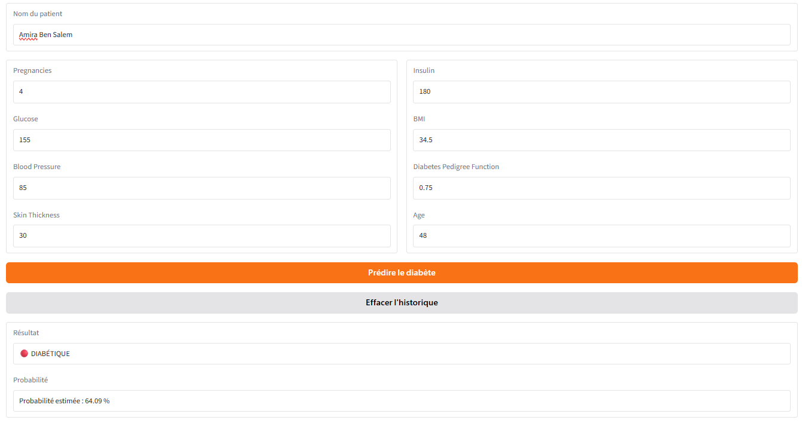
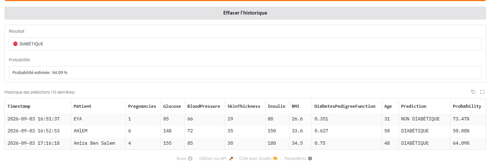
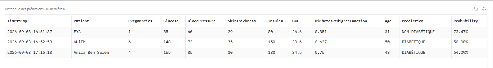
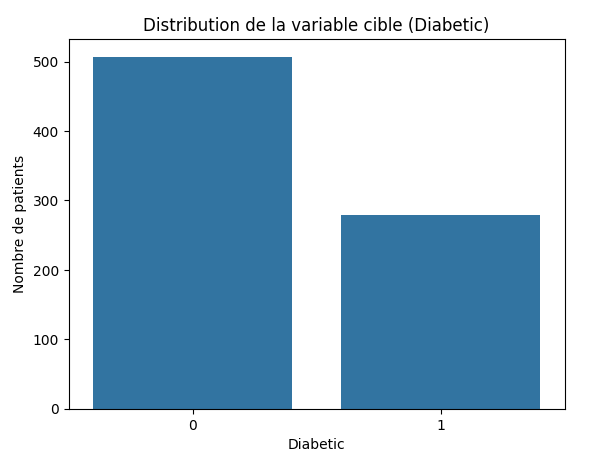
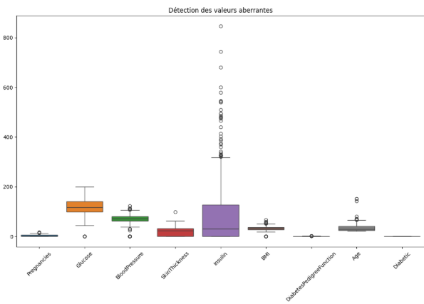
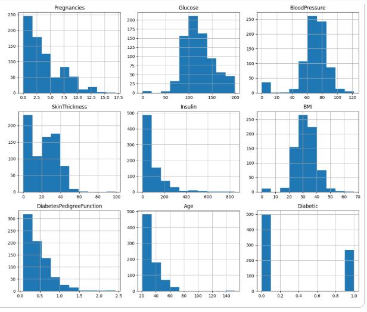
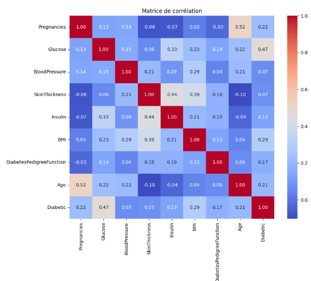

# Système de Prédiction du Diabète

## Description
Projet de Machine Learning visant à prédire si un patient est diabétique 
à partir de caractéristiques médicales (âge, glucose, BMI, etc.).

## Objectif
- Analyser un dataset médical
- Nettoyer et préparer les données
- Comparer plusieurs algorithmes de classification
- Déployer une interface web avec Gradio

## Dataset
- **Source** : Pima Indians Diabetes Database
- **Nombre de patients** : 768
- **Variables** : 8 features (Pregnancies, Glucose, BloodPressure, etc.)
- **Cible** : Diabetic (0 = non diabétique, 1 = diabétique)

## Technologies utilisées
- Python 3
- Pandas, NumPy
- Matplotlib, Seaborn
- Scikit-learn
- Gradio

##  Résultats
| Modèle | Accuracy | Precision | Recall | F1-Score |
|--------|----------|-----------|--------|----------|
| Decision Tree | 69.5% | 55.9% | 61.1% | 58.4% |
| KNN | 71.4% | 60.4% | 53.7% | 56.9% |
| Logistic Regression | 70.8% | 59.6% | 51.9% | 55.4% |
| Random Forest | 74.0% | 64.0% | 59.3% | 61.5% |
| **AdaBoost** | **77.3%** | **69.4%** | **63.0%** | **66.0%** |

## Structure du projet
```text
diabetes_prediction/
├── 📄 diabetes_prediction.ipynb   # Notebook complet avec le code et les analyses
├── 📄 DATA_DIABETE.csv            # Dataset utilisé pour l'entraînement
├── 📄 diabetes_history.csv        # Historique des prédictions (généré par l'app)
└── 📄 README.md                   # Ce fichier

## Comment utiliser
1. Ouvrir le notebook dans Google Colab ou Jupyter
2. Exécuter toutes les cellules dans l'ordre
3. Tester l'interface Gradio à la fin du notebook

## Auteur
Iben Radhouane Eya 
https://www.linkedin.com/in/eya-iben-radhouane-5b74a525b/
eya.ibenradhouane@polytechnicien.tn

## Aperçu du Système

### Interface de prédiction





### Résultats




